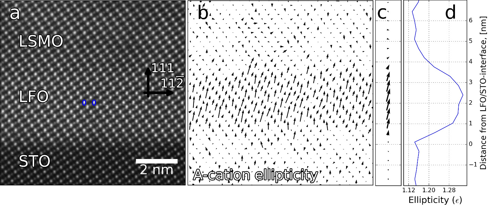
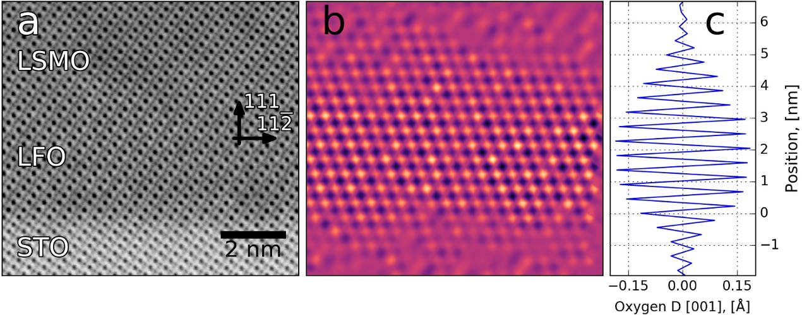

Welcome to Atomap's documentation!
==================================

News
----

**2024-02-17: Atomap 0.4.0 released**

This release is the first to work with the new 2.0.0 version of HyperSpy.
The major change is a large improvement in plotting speed, for example  ``sublattice.plot()`` or ``sublattice.plot_planes()``, thanks to a reimplementation of HyperSpy's marker functionality. Thanks to `Carter Francis  <https://gitlab.com/CSSFrancis>`_ for the merge request!
There has also been some minor updates of the install instructions, and fixes for deprecation warnings.

*2023-11-18: Atomap 0.3.4 released*

This release has a large performance improvement for the 2D Gaussian refinement, which is especially noticeable for large images with many atoms.
A new parameter, ``nearest_neighbors``, has been added to ``sublattice.construct_zone_axes``: increasing it will give more atomic planes.
Note: due to a new API-breaking version of HyperSpy (2.0.0), this Atomap release will be the last which will work with the older HyperSpy versions (1.x.x).
Thus, the next releases will only work with HyperSpy 2.0.0 or higher, most users should not notice any differences.

About Atomap
------------
Atomap is a Python library for analysing atomic resolution scanning transmission electron microscopy images.
It relies in fitting 2-D Gaussian functions to every atomic column in an image, and automatically find all major symmetry
axes. The full procedure is explained in the article `Atomap: a new software tool for the automated analysis of
atomic resolution images using two-dimensional Gaussian fitting <https://dx.doi.org/10.1186/s40679-017-0042-5>`_.

The easiest way to try Atomap is via Binder: `introductory Jupyter Notebook <https://mybinder.org/v2/git/https%3A%2F%2Fgitlab.com%2Fatomap%2Fatomap_demos.git/release?labpath=introduction_to_atomap.ipynb>`_.
To install Atomap on your own computer, see the :ref:`install instructions <install>`.

    Measuring the ellipticity of atomic columns. `More info <https://ascimaging.springeropen.com/articles/10.1186/s40679-017-0042-5#Fig6>`_

    Mapping the variation in distance between oxygen columns. `More information <https://ascimaging.springeropen.com/articles/10.1186/s40679-017-0042-5#Fig5>`_

Atomap is under development and still in alpha, so bugs and errors can be expected.
Bug reports and feature requests are welcome on the `issue tracker <https://gitlab.com/atomap/atomap/issues>`_.
Contributors are welcome too!

If you publish scientific articles using Atomap, please consider citing the article `Atomap: a new software tool for the automated analysis of
atomic resolution images using two-dimensional Gaussian fitting <https://dx.doi.org/10.1186/s40679-017-0042-5>`_.
(*M. Nord et al, Advanced Structural and Chemical Imaging 2017 3:9*)

Atomap is available under the GNU GPL v3 license.
The source code is found in the `GitLab repository <https://gitlab.com/atomap/atomap/tree/master/>`_.

Contents on this webpage
------------------------

.. toctree::
   :maxdepth: 2

   install
   start_atomap
   finding_atom_lattices
   analysing_atom_lattices
   dumbbell_lattice
   several_phases
   gui_functions
   automation
   examples
   quantification
   working_with_atomic_models
   nanoparticle_example
   quantify_scan_distortions
   make_testdata
   making_nice_figures
   various_tools
   contribute
   development_guide
   api_documentation

* :ref:`genindex`
* :ref:`modindex`

Old news
--------

*2023-5-17: Atomap 0.3.3 released*

This is a small maintenance release, fixing some deprecation warning, style issues, and fixing a plotting bug when visualizing vectors.

*2022-4-28: Atomap 0.3.2 released*

This is a maintenance release, updating Atomap to work with the newly released HyperSpy 1.7.

*2021-6-11: Atomap 0.3.1 released!*

This is a small release, with one bug fix from `Tom Slater <https://gitlab.com/TomSlater>`_, and two performance improvements from `Niels Cautaerts <https://gitlab.com/din14970>`_. The latter are related to finding the initial atomic column positions, and will especially improve the processing time for large images.

*2021-4-23: Try Atomap without having to install anything, via Binder*

- `Introductory Jupyter Notebook <https://mybinder.org/v2/gl/atomap%2Fatomap_demos/release?filepath=introduction_to_atomap.ipynb>`_

*2021-1-30: Atomap 0.3.0 released!*

* Information about the 3D structure of ``Sublattices`` can now be added, allowing for 3D atomic models to be "converted" into an ``Atom_Lattice`` via the `Atomic Simulation Environment <https://wiki.fysik.dtu.dk/ase/>`_, and vice versa. This 3D information can be set manually, or via the intensity for homogeneous structures see :ref:`statistical method <statistical_method>` and :ref:`working with atomic models <working_with_atomic_models>` for more info. Thanks to `Tom Slater <https://gitlab.com/TomSlater>`_ and `Eoghan O'Connell <https://gitlab.com/PinkShnack>`_ for implementing this!
* The performance of atomic column integration has been greatly improved, ``atomap.integrate`` and ``Atom_Lattice.integrate_column_intensity`` will be much faster now. Thanks to `Thomas Aarholt <https://gitlab.com/thomasaarholt>`_!
* :py:meth:`~atomap.atom_lattice.Atom_Lattice.set_scale` method in ``Atom_Lattice`` and ``Sublattice`` has been added for easily setting the scale and unit.
* Better support for visualizing ``Atom_Lattice`` and ``Sublattice`` objects with scaled units. Thanks to `Eoghan O'Connell <https://gitlab.com/PinkShnack>`_ for adding this.

*2020-1-29: Atomap 0.2.1 released!*

* New method for getting a pair distribution function, see the :ref:`documentation <pair_distribution_function>` for more info. Thanks to `Tom Slater <https://gitlab.com/TomSlater>`_ for implementing this!
* Add a method for getting the local, often high frequency, scanning distortions utilizing the shape of the atomic columns: :ref:`Quantify scan distortions <quantify_scan_distortions>`.
* Improved the progressbar when using Atomap in Jupyter Notebooks. Thanks to `Alexander Skorikov <https://gitlab.com/askorikov>`_!

*2019-10-17: Atomap 0.2.0 released!*

* Greatly improved :ref:`documentation <dumbbell_lattice>`, `notebook <https://gitlab.com/atomap/atomap_demos/blob/release/dumbbell_example_notebook/dumbbell_example.ipynb>`_ and several new functions for analysing images with dumbbell features, like Si or GaAs.
* New GUI tool for :ref:`selection a subset of atom positions <atom_selector_gui>`, making it easier to work on images with :ref:`several phases <several_phases>`.
* :ref:`Statistical quantification <statistical_method>` using Gaussian mixture model. Thanks to `Tom Slater <https://gitlab.com/TomSlater>`_ for implementing this!
* Functions in the ``Atom_Position`` class: :py:meth:`~atomap.atom_position.Atom_Position.calculate_max_intensity` and :py:meth:`~atomap.atom_position.Atom_Position.calculate_min_intensity`. Thanks to `Eoghan O'Connell <https://gitlab.com/PinkShnack>`_ for implementing this!

*2019-03-05: Atomap 0.1.4 released!*

This release includes:

* Functions to find shifts within unit cells, often seen in materials with polarization. This can for example be used to find shifts in B-cations in relation to the A-cations in a perovskite structure: :ref:`finding_polarization`.
* Big optimization in refining the atom positions using centre of mass, which makes it much easier to work with images containing a large number of atoms. For smaller images the improvement is around 5-10 times, while for larger ones it is 1000 times faster. Thanks to `Thomas Aarholt <https://gitlab.com/thomasaarholt>`_ for `implementing this <https://gitlab.com/atomap/atomap/merge_requests/47>`_!
* Similar optimizations to :py:meth:`~atomap.sublattice.Sublattice.get_model_image`, which is primarily used to generate test data via the :ref:`dummy_data_module` module. This means generating test data like :py:func:`~atomap.dummy_data.get_fantasite` is 60 times faster, with even bigger improvements to larger test data. Thanks to Annick De Backer at EMAT for tips on how to improve this!

Another optimization for the :ref:`integrate` functionality is in the pipeline, with a `merge request <https://gitlab.com/atomap/atomap/merge_requests/48>`_ from Thomas Aarholt.

*2018-11-26: Atomap 0.1.3 released!*

Major features in this release includes:

* A GUI function for adding and removing atoms, which makes it easier to set up the initial atom positions. See :ref:`atom_adder_gui` for more information.
* A GUI function for toggling if atom positions should be refined or not, see :ref:`toggle_atom_refine`.
* Better handling of hexagonal structures, by adding a adding a ``vector_fraction`` parameter to ``find_missing_atoms_from_zone_vector``, thanks to Eoghan O'Connell for the suggestion!
* The addition of ``mask_radius`` to the refine functions, which makes it easier to work with non-perodic atom positions, for example :ref:`single_atom_sublattice`.

*2018-06-13: Atomap 0.1.2 released!*

This is a minor release, including a `signal` attribute in `Sublattice` and `Atom_Lattice` classes, minor changes in package dependencies and some improvements to the documentation.

*2018-03-25: Atomap 0.1.1 released!*

The major new features are methods for integrating atomic column intensity and quantifying this intensity in ADF STEM images, see :ref:`integrate` and :ref:`absolute_integrator` for more info.
Thanks to Katherine E. MacArthur for adding this!
Other features include tools for rotating atomic positions for plotting purposes (:ref:`rotate_images_points`), and reduced memory use when processing data with many atoms.

*2017-11-16: Atomap 0.1.0 released!*

We are happy to announce a new Atomap release.
It includes a **major makeover** of the tutorial, start with :ref:`finding_atom_lattices`.
New features in this release are methods for finding atomic column intensity, new and simple plotting tools and a module for generating test data.

*2017-07-03: version 0.0.8 released!*

New features: ability to process dumbbell structures, fitting of multiple 2D Gaussians at the same time, improved background subtraction during 2D Gaussian fitting, and processing of nanoparticles.
